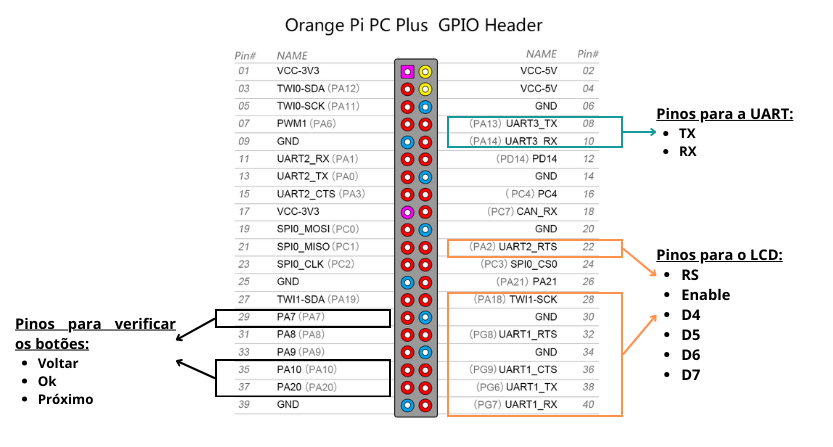
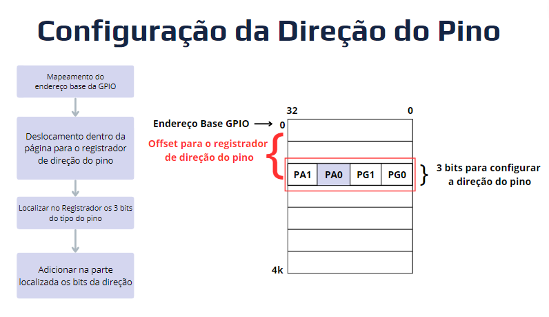

<h1 align="center"> Sistema de Temperatura e Umidade </h1>
<h3 align="center"> Projeto de interface homem-máquina em Orange Pi PC Plus usando linguagem Assembly  </h3>

 
<h2> Sobre o Projeto</h2>

<h2>  Equipe:  </h2>
<uL> 
	<li>Samara dos Santos Ferreira </li>
	<li>Silvio Azevedo de Oliveira </li>
	<li>Sival Leão de Jesus </li>
  <li>Thiago Neri dos Santos Almeida </li>
</ul>

<h1 align="center"> Sumário </h1>

	<ul>
        <li><a href="#">  Descrição dos equipamentos e software utilizados</a></li>
        <li><a href="#"> Mapeamento de memória</a></li>
        <li><a href="#GPIO"> GPIO </a></li>
        <li><a href="#"> UART </a></li>
        <li><a href="#"> Display LCD </a></li>
        <li><a href="#"> Solução Geral do projeto </a></li>
        <li><a href="#"> Testes Realizados </a></li>
        <li><a href="#"> Conclusão </a></li>
        <li><a href="#"> execução do projeto </a></li>
        <li><a href="#"> Referências </a></li>
	</ul>	

 
<h2> Descrição dos equipamentos e software utilizados</h2>

 

 
<h2> Mapeamento de memória</h2>

 

 
<h2> GPIO</h2>

 

A Entrada/Saída de Propósito Geral (GPIO) representa uma interface com pinos que podem ser configurados tanto como entrada quanto como saída de dados, conferindo flexibilidade para interagir com componentes externos no sistema digital da SBC Orange Pi PC Plus. Além disso, destaca-se a presença de hardware integrado na pinagem, oferecendo opções adicionais de configuração para os pinos. No total, são disponibilizados 28 pinos, divididos em 7 tipos (PA, PC, PD, PE, PF, PG e PL). Esses pinos podem ser manipulados tanto a nível de software quanto diretamente via registrado.

Para atender aos objetivos do projeto, foram utilizados apenas 11 pinos, sendo 7 do tipo PA e 4 do tipo PG. Esses pinos foram distribuídos em diversas funcionalidades específicas: 2 pinos do tipo PA foram dedicados à comunicação via padrão Universal Asynchronous Receiver/Transmitter (UART); 6 pinos foram alocados para o controle do LCD, sendo 2 do tipo PA e 4 do tipo PG; e os 3 pinos restantes do tipo PA foram destinados aos botões de controle da interface do projeto.

Para visualizar a distribuição dos pinos e suas funções designadas, está anexado uma imagem apresentando o diagrama de pinagem da Orange Pi, destacando os pinos utilizados e suas respectivas funções na resolução do problema.

<strong> Diagrama da pinagem da Orange Pi e as respectivos funções de cada pino no projeto</strong> 

**Configuração da direção do pino**

Para empregar cada pino com suas funções designadas, é essencial configurar a direção de cada pino individualmente. A definição da direção do pino é realizada por meio da manipulação de registradores. Nesse contexto, cada pino tem 3 bits reservados nos registradores para indicar seu comportamento. Importante notar que nem todos os pinos oferecem as mesmas opções de seleção, pois alguns estão reservados para funções específicas, como no caso da UART.

Na solução adotada para o projeto, optou-se por configurar os pinos de acordo com as seguintes definições:

* **Entrada:** identificada pela sequência de bits 000; 
* **Saída:** representada pela sequência de bits 001;
* **UART:** caracterizada pela sequência de bits 011.

A atribuição desses valores foi realizada seguindo uma sequência lógica de 4 passos. Nesse sentido, segue em anexo um fluxograma que ilustra a lógica utilizada, bem como a explicação dos passos:

O processo de atribuição desses valores segue uma lógica em quatro passos. Inicialmente, o fluxograma inicia-se com uma solicitação ao Sistema Operacional por meio de uma *syscall*, buscando a referência virtual do endereço base da GPIO. Uma vez obtido esse endereço, realiza-se um deslocamento dentro da página da GPIO para encontrar o offset onde está localizado o registrador da direção. Dado que existem múltiplas referências de direção nesse registrador, é necessário um deslocamento adicional para localizar os 3 bits correspondentes ao pino desejado. Por fim, esses 3 bits são adicionados ao local apropriado e salvos no registrador, configurando assim a direção desejada para o pino.

**Leitura/Escrita do Valor Lógico do Pino**

O processo de leitura ou escrita de um pino na GPIO segue uma abordagem semelhante à configuração da direção do pino. Nesse contexto, o valor lógico do pino é representado por um único bit, armazenado em um registrador na memória física, exclusivamente designado para os dados dos pinos. Cabe ressaltar que esse registrador de dados é organizado por tipos de pinos, com os tipos PA sendo alocados em um registrador diferente dos pinos PG. Além disso, dentro do registrador, os dados são organizados tendo a referência do pino, por exemplo, o pino PA0 é guardado na posição 0 do registrador.

Para compreender melhor o fluxo de escrita ou leitura dos valores dos pinos na Orange Pi, segue um fluxograma explicativo:

 
O fluxograma inicia-se com uma solicitação ao Sistema Operacional por meio de uma *syscall*, buscando a referência virtual do endereço base da GPIO. Após adquirir o endereço, há um deslocamento dentro da página para encontrar o offset do registrador de dados. Considerando que existem múltiplas referências desse registrador, um deslocamento adicional é necessário para localizar o bit correspondente ao pino desejado. Uma vez identificado o local correto, o valor lógico do pino é escrito ou lido, dependendo da operação desejada. Este processo é concluído ao salvar ou recuperar o valor no registrador, ajustando assim o estado lógico do pino conforme necessário.

 
<h2> UART</h2>

 

 
<h2> Display LCD</h2>

 

 
<h2> Solução Geral do projeto</h2>

 

 
<h2> Testes Realizados</h2>

 

 
<h2> Conclusão</h2>

 

 
<h2> Referências</h2>

 

