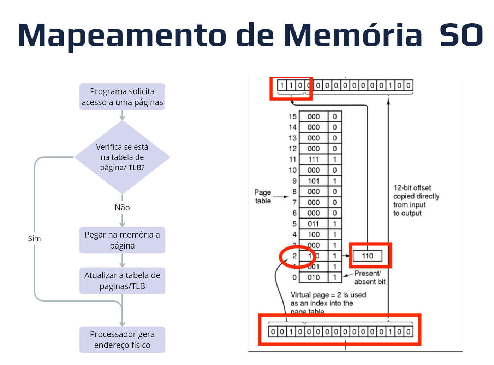
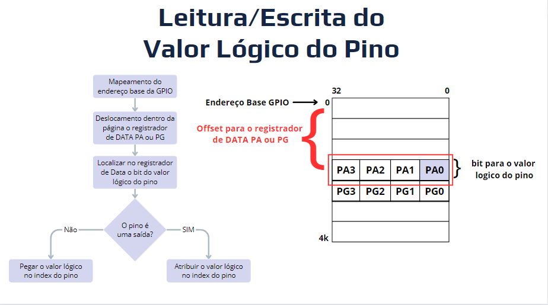
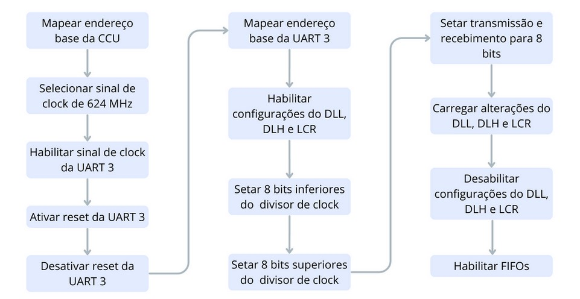
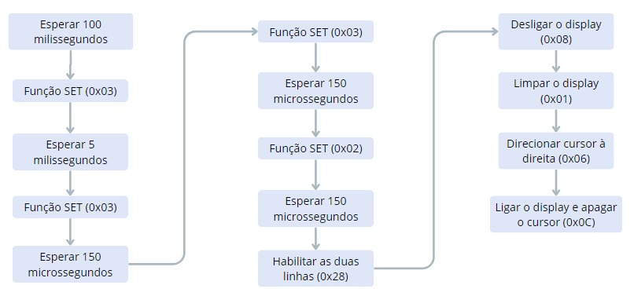
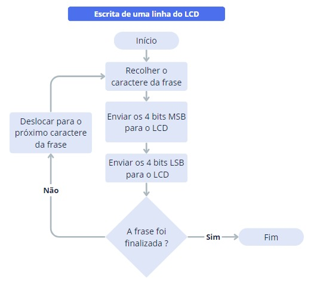
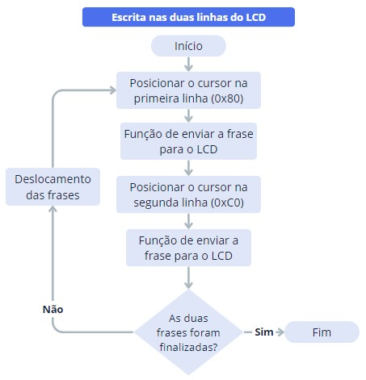

<h1 align="center"> Sistema de Temperatura e Umidade </h1>
<h3 align="center"> Projeto de interface homem-máquina em Orange Pi PC Plus usando linguagem Assembly  </h3>

 
<h2> Sobre o Projeto</h2>

<h2>  Equipe:  </h2>
<uL> 
	<li>Samara dos Santos Ferreira </li>
	<li>Silvio Azevedo de Oliveira </li>
	<li>Sival Leão de Jesus </li>
  <li>Thiago Neri dos Santos Almeida </li>
</ul>

<h1 align="center"> Sumário </h1>

	<ul>
        <li><a href="#">  Descrição dos equipamentos e software utilizados</a></li>
        <li><a href="#"> Mapeamento de memória</a></li>
        <li><a href="#GPIO"> GPIO </a></li>
        <li><a href="#"> UART </a></li>
        <li><a href="#displayLCD"> Display LCD </a></li>
        <li><a href="#interfaceUsuario"> Interface do Usuário </a></li>
        <li><a href="#"> Solução Geral do projeto </a></li>
        <li><a href="#"> Testes Realizados </a></li>
        <li><a href="#"> Conclusão </a></li>
        <li><a href="#"> Execução do projeto </a></li>
        <li><a href="#"> Referências </a></li>
	</ul>	

 
<h2> Descrição dos equipamentos e software utilizados</h2>

 

 
<h2> Mapeamento de memória</h2>

 

O mapeamento de memória é uma técnica que visa organizar e gerenciar o espaço de endereçamento na memória física. Neste contexto, explora-se como esse conceito é aplicado no desenvolvimento do projeto, abrangendo tanto o âmbito do software quanto o hardware.

<h3> Mapeamento a nível de Software</h3>

O gerenciamento da memória física é uma função desempenhada pelo sistema operacional, utilizando a abstração de memória virtual. Ao receber um endereço de memória, o sistema operacional requer as autorizações adequadas para manipular o arquivo, tratando os dados como arquivos. Essas autorizações incluem permissões essenciais, como leitura, escrita, a capacidade de selecionar o endereço virtual para o valor endereçado e a habilidade de compartilhar dados com outros arquivos.

Para acessar a memória física, o processo inicia-se ao entrar no diretório /dev/mem, onde as seções desejadas da memória estão localizadas. Em seguida, é necessário fornecer ao sistema operacional um endereço de memória física. A execução de uma System Call ocorre, momento em que o sistema operacional verifica se o endereço está presente na tabela de páginas ou no buffer Translation Lookaside Buffer (TLB). Se não estiver, o sistema operacional acessa diretamente a memória, recuperando o dado armazenado na posição endereçada. A página e o TLB são atualizados, e ao usuário é concedida uma referência virtual para acessar a memória física.

Segue anexo um fluxograma que ilustra os passos utilizados, acompanhado de uma tabela detalhando as System Calls empregadas no projeto.

  

<strong> Fluxograma do mapeamento de memória em nível de software </strong> 

<h3> Mapeamento a nível de Hardware</h3>

Ao buscar os dados armazenados na memória física através do barramento de sistema solicitado pela CPU, os dados passam por um decodificador/controlador de endereços que sinaliza a localização do dado solicitado. O controlador envia um sinal de controle para o local solicitado, podendo ser a memória principal, um registrador da General Purpose Input/Output (GPIO) ou até um registrador de dados hardware específicos, como a Universal Asynchronous Receiver-Transmitter (UART). Mesmo tendo um endereço de memória física, os dados obtidos do mapeamento não estão presentes na memória principal, mas sim em locais separados e específicos para suas funções.

Segue em anexo um diagrama de uma versão simplificada do processo descrito. 

 
<h2> GPIO</h2>

 

A Entrada/Saída de Propósito Geral (GPIO) representa uma interface com pinos que podem ser configurados tanto como entrada quanto como saída de dados, conferindo flexibilidade para interagir com componentes externos no sistema digital da SBC Orange Pi PC Plus. Além disso, destaca-se a presença de hardware integrado na pinagem, oferecendo opções adicionais de configuração para os pinos. No total, são disponibilizados 28 pinos, divididos em 7 tipos (PA, PC, PD, PE, PF, PG e PL). Esses pinos podem ser manipulados tanto a nível de software quanto diretamente via registrado.

Para atender aos objetivos do projeto, foram utilizados apenas 11 pinos, sendo 7 do tipo PA e 4 do tipo PG. Esses pinos foram distribuídos em diversas funcionalidades específicas: 2 pinos do tipo PA foram dedicados à comunicação via padrão UART; 6 pinos foram alocados para o controle do LCD, sendo 2 do tipo PA e 4 do tipo PG; e os 3 pinos restantes do tipo PA foram destinados aos botões de controle da interface do projeto.

Para visualizar a distribuição dos pinos e suas funções designadas, está anexado uma imagem apresentando o diagrama de pinagem da Orange Pi, destacando os pinos utilizados e suas respectivas funções na resolução do problema.

  

<strong> Diagrama da pinagem da Orange Pi e as respectivos funções de cada pino no projeto</strong> 

<h3>Configuração da Direção do Pino</h3>	

Para empregar cada pino com suas funções designadas, é essencial configurar a direção de cada pino individualmente. A definição da direção do pino é realizada por meio da manipulação de registradores. Nesse contexto, cada pino tem 3 bits reservados nos registradores para indicar seu comportamento. Importante notar que nem todos os pinos oferecem as mesmas opções de seleção, pois alguns estão reservados para funções específicas, como no caso da UART.

Na solução adotada para o projeto, optou-se por configurar os pinos de acordo com as seguintes definições:

* **Entrada:** identificada pela sequência de bits 000; 
* **Saída:** representada pela sequência de bits 001;
* **UART:** caracterizada pela sequência de bits 011.

A atribuição desses valores foi realizada seguindo uma sequência lógica de 4 passos. Nesse sentido, segue em anexo um fluxograma que ilustra a lógica utilizada, bem como a explicação dos passos:

  

<strong> Fluxograma da configuração da direção do pino </strong> 

O processo de atribuição desses valores segue uma lógica em quatro passos. Inicialmente, o fluxograma inicia-se com uma solicitação ao Sistema Operacional por meio de uma *syscall*, buscando a referência virtual do endereço base da GPIO. Uma vez obtido esse endereço, realiza-se um deslocamento dentro da página da GPIO para encontrar o *offset* onde está localizado o registrador da direção. Dado que existem múltiplas referências de direção nesse registrador, é necessário um deslocamento adicional para localizar os 3 bits correspondentes ao pino desejado. Por fim, esses 3 bits são adicionados ao local apropriado e salvos no registrador, configurando assim a direção desejada para o pino.

<h3>Leitura/Escrita do Valor Lógico do Pino</h3>	

O processo de leitura ou escrita de um pino na GPIO segue uma abordagem semelhante à configuração da direção do pino. Nesse contexto, o valor lógico do pino é representado por um único bit, armazenado em um registrador na memória física, exclusivamente designado para os dados dos pinos. Cabe ressaltar que esse registrador de dados é organizado por tipos de pinos, com os tipos PA sendo alocados em um registrador diferente dos pinos PG. Além disso, dentro do registrador, os dados são organizados tendo a referência do pino, por exemplo, o pino PA0 é guardado na posição 0 do registrador.

Para compreender melhor o fluxo de escrita ou leitura dos valores dos pinos na Orange Pi, segue um fluxograma explicativo:

  

<strong> Fluxograma da leitura/escrita do valor lógico do pino</strong> 

 
O fluxograma inicia-se com uma solicitação ao Sistema Operacional por meio de uma *syscall*, buscando a referência virtual do endereço base da GPIO. Após adquirir o endereço, há um deslocamento dentro da página para encontrar o *offset* do registrador de dados. Considerando que existem múltiplas referências desse registrador, um deslocamento adicional é necessário para localizar o bit correspondente ao pino desejado. Uma vez identificado o local correto, o valor lógico do pino é escrito ou lido, dependendo da operação desejada. Este processo é concluído ao salvar ou recuperar o valor no registrador, ajustando assim o estado lógico do pino conforme necessário.

<h3>Inicialização da GPIO no Projeto</h3>	

Na fase inicial do projeto, o processo de inicialização segue a atribuição de direção para os 11 pinos essenciais. Para fornecer uma visão clara dessa configuração, apresenta-se a seguir uma tabela detalhando a relação entre a pinagem utilizada e suas respectivas direções:

| Pino  	| Modo     | Correspondente	|
| ------------- | ------------- | ------------- |
| PA7  	  | Input    |  Botão (Voltar)	|
| PA10    | Input    |  Botão (OK)	    |
| PA20	  | Input    |  Botão (Próximo) |
| PA13 	  | UART3_TX |  RX (FPGA)	|
| PA14    | UART3_RX |  TX (FPGA)	|
| PA2	    | Output   |  RS (LCD) |
| PA18 	  | Output   |  E (LCD) |
| PG8  	  | Output   | 	D4 (LCD)|
| PG9	    | Output   |  D5 (LCD)|
| PG6 	  | Output   |  D6 (LCD)|
| PG7  	  | Output   |  D7 (LCD)|

<strong> Tabela com as direções e funções de cada pino</strong> 

 

 
<h2> UART</h2>

 

A Orange Pi PC Plus possui um sistema que possibilita realizar comunicação serial, seguindo o protocolo UART para troca de dados. Existe mais de uma UART que pode ser utilizada, cada uma possuindo suas próprias portas de entrada e de saída de dados. A que foi usada no sistema foi a UART 3.

<h3>Habilitação da UART</h3>	

Antes de setar as configurações específicas de troca de dados da UART 3, deve-se habilitar a utilização e alteração dos espaços dela. Seguindo esse processo, são realizados os seguites passos:

1. É mapeado o endereço base da CCU (0x01C20000). Esse endereço base é usado para modificar os espaços citados abaixo;
2. No endereço do registrador APB2_CFG_REG (0x0058), é setado qual sinal de clock será usado no sistema. O bit 25 do registrador é setado para 1, indicando o sinal de clock PLL_PERIPH0, que possui frequência de 624 MHz. Esse é o sinal indicado pelo processador para ser usado na comunicação serial;
3. No endereço do regitrador BUS_CLK_GATING_REG3 (0x006C), é habilitado o sinal de clock da UART utilizada. O bit 19 é setado para 1, habilitando o sinal de clock da UART 3;
4. No endereço do registrador BUS_SOFT_RST_REG4 (0x02D8), é habilitado ou desabilitado o reset da UART utilizada. O bit 19 é setado para 0, setando o reset da UART 3. Isto é feito para evitar que configurações feitas anteriormente por outros aparelhos possam atrapalhar o andamento do sistema;
5. Depois que a UART 3 é resetada, o reset é desativado para que os dados de configuração possam ser especificados e mantidos. Assim, o bit 19 do registrador BUS_SOFT_RST_REG4, é setado para 1.

<h3>Configuração da UART</h3>	

Com o sinal de clock correto habilitado e o reset desativado, os dados de configuração podem ser indicados. As alterações feitas se resumem a: indicar o valor do divisor de sinal de clock, que resulta no baud rate desejado; indicar quantos bits serão transmitidos e recebidos em cada troca de dados; e habilitar os FIFOs de transmissão e recebimento, que funcionam como espaços de intermédio no caminho dos dados. Sendo assim, o processo de configuração segue os seguintes passos:

1. É mapeado o endereço base da UART 3 (0x01C28C00). O resultado do mapeamento é guardado no R9, para que as configurações sejam setadas e, posteriormente, os dados possam ser transmitidos e lidos;
2. O bit 7 do registrador LCR (0x000C) indica se os endereços que serão utilizados serão os de transmissão/recebimento de dados ou os do valor do divisor de sinal de clock. É preciso diferenciar quais serão usados pelo fato do endereço 0x0000 ser utilizado para acessar os FIFOs e também para indicar os 8 bits inferiores do valor do divisor. Dessa forma, o bit 7 do LCR é setado para 1, indicando que será setado o valor do divisor;
3. O bit 1 do registrador HALT (0x00A4) habilita alterações no valor do divisor e no endereço LCR (exceto o bit 7). Assim, o bit 1 do HALT é setado para 1, habilitando as alterações;
4. Os 8 bits menos significativos do DLL (0x0000) e do DLH (0x0004) indicam os 8 bits inferiores e os 8 bits superiores, respectivamente, do valor do divisor. Neste passo, os bits que indicam o valor do divisor são setados;
5. Os bits 1 e 0 do LCR indicam quantos bits serão lidos e transmitidos a cada troca de dados. Os dois bits são setados para 1, indicando que a comunicação será de 8 bits por vez;
6. O bit 2 do HALT indica o carregamento das alterações feitas no valor do divisor e no registrador LCR. Assim, o bit 2 é setado para 1, para carregar as alterações. Depois que o carregamento é concluído, o bit é limpo automaticamente;
7. O bit 7 do LCR é setado para 0, indicando que os espaços utilizados serão para a transmissão e recebimento de dados;
8. O bit 1 do HALT é setado para 0, para desabilitar alterações no valor do divisor e no registrador LCR;
9. O bit 0 do registrador FCR habilita ou desabilita os FIFOs de transmissão e recebimento de dados. Assim, o bit 0 do FCR é setado para 1, habilitando os FIFOs.

Seguindo os passos de habilitação e configuração da UART, os bytes podem ser lidos e recebidos normalmente. Abaixo, está o fluxograma que apresenta, de forma resumida, o processo explicado.

  

<strong>Fluxograma da Habilitação e configuração da UART</strong>

<h3>Cálculo do baud rate</h3>	

A fórmula usada para calcular o baud rate é:

  * Baud rate = frequência do sinal de clock / (divisor * 16)

Como a frequência do sinal de clock é de 624 MHz, foi setado o valor do divisor para 4062. Isso resulta em um baud rate de 9600, que é a taxa utilizada na comunicação serial do código inserido na FPGA na Fase 1 do projeto. Dessa forma, os valores binários setados nos registradores DLL e DLH foram:

  * Registrador DLL: 11011110.
  * Registrador DLH: 1111.

<h3>Funções da UART</h3>	

Foram utilizadas 3 funções para acessar a UART. Elas são explicadas a seguir:

  * TX_UART: recebe como parâmetros o endereço base da UART 3 em R9, e o byte a ser transmitido em R0. Essa função insere o byte de R0 no endereço THR (0x0000) da UART 3, que tem a função de colocar o byte no FIFO de transmissão para ser passado pela porta da comunicação serial.
  * RX_UART: recebe como parâmetro o R9 com o endereço base da UART 3. Essa função lê um byte do endereço RBR (0x0000) da UART 3, que tem a função de acessar o FIFO de recebimento da comunicação serial. O byte lido é retornado em R0.
  * CHECK_EMPTY_RX_UART: essa função checa a situação do FIFO de recebimento de dados. Recebe como parâmetro o endereço base da UART 3 em R9. Lê o regitrador USR (0x007C), que contém os status da UART. O bit 3 indica se o FIFO de recebimento está vazio ou não. Esse bit é colocado no LSB do R0 e é retornado. Se esse bit for 0, o FIFO está vazio, se for 1, não está.

<!-- DISPLAY LCD -->

 
<h2> Display LCD</h2>

 

O display LCD utilizado pode ser configurado para ser acionado sob o controle de um microprocessador de 4 ou 8 bits. No modo de 8 bits, os oito pinos de dados são usados para escrever informações de maneira paralela, enquanto no modo de 4 bits, os dados são processados em duas etapas: primeiramente, é transmitido um conjunto de 4 bits de informações, e depois os 4 bits restantes. 

<h3>Inicialização do LCD</h3>	

Quanto à inicialização do LCD, é primordial configurar o controlador no modo de 4 bits, uma vez que ele inicia automaticamente no modo de 8 bits, independentemente do número de linhas de dados conectadas entre o controlador e o módulo LCD. O procedimento de inicialização é delineado da seguinte forma:

- Ao aplicar a energia pela primeira vez, é necessário aguardar 100 ms, pois a ativação requer um atraso significativo;

- Os quatro passos subsequentes são semelhantes e constituem a configuração do modo de 4 bits. No primeiro passo, envia-se o comando SET **(0x03)** para reiniciar efetivamente o controlador do LCD, sendo os 4 bits inferiores irrelevantes. Após o envio da função, é necessário um atraso de 5 ms;

- Na segunda instância do comando SET **(0x03)**, é exigido um atraso de 150 µs;

- Na terceira instância, o tempo de atraso é o mesmo, mas o controlador já reconhece que se trata de uma função de *reset* e está pronto para receber a instrução SET "real";

- Por fim, é enviado o comando SET **(0x02)** para entrar no modo de 4 bits, indicando que o controlador LCD lerá apenas os quatro pinos de dados superiores a cada uso do Enable. O atraso necessário nesse envio é de 150 µs;

- Em seguida, envia-se o comando para habilitar as duas linhas **(0x28)**;

- Posteriormente, o comando de controle liga/desliga do display é utilizado para fazer o seu desligamento **(0x08)**;

- Após isso, procede-se à limpeza do display **(0x01)**;

- A instrução subsequente configura o modo de entrada, determinando que o cursor e/ou display deve mover-se à direita ao inserir uma sequência de caracteres **(0x06)**;

- A sequência de inicialização então é concluída, sendo crucial notar que o display permanece desligado. Dessa forma, como último passo, envia-se a instrução para ligar o display e apagar o cursor **(0x0C)**.

Abaixo, apresenta-se o fluxograma da inicialização do LCD, resumindo de maneira clara o passo a passo desse processo e seu fluxo.

  

<strong>Fluxograma da inicialização do Display LCD</strong>

<h3>Escrita no LCD</h3>

No que refere-se à fase de escrita, o procedimento inicial é a posição do cursor na primeira linha, através do envio do comando **(0x80)**. Posteriormente, utiliza-se uma função específica para transmitir a frase ao LCD. Se a extensão da frase for inferior a 17 caracteres, a escrita é efetuada diretamente no LCD. No entanto, caso a frase exceda esse limite, realiza-se um deslocamento dos caracteres até que a totalidade da mensagem seja visível, e o retorno ao ponto inicial ocorre ao término da escrita da frase. Se um botão for pressionado, essa visualização é interrompida e a mudança de tela é realizada.

O fluxograma abaixo apresenta de maneira visual o processo de escrita em uma linha do LCD.

  

<strong>Fluxograma da escrita de uma linha no Display LCD</strong>

Para a escrita na segunda linha, o cursor é posicionado ao enviar o comando **(0xC0)**. Em seguida, realiza-se uma comparação do tamanho da frase e segue-se a mesma verificação descrita anteriormente, para o caso da primeira linha. Este processo está exemplificado no fluxograma a seguir, o qual trata-se da escrita nas duas linhas do display. Após o envio de ambas as frases, uma verificação é realizada para determinar se a escrita foi concluída ou não. Em caso afirmativo, o procedimento é encerrado. Caso contrário, ocorre o deslocamento dos caracteres da frase em questão.

  

<strong>Fluxograma da escrita em duas linhas no Display LCD</strong>

 
<h2> Interface do Usuário </h2>

A interface do usuário é projetada visando demonstrar de maneira abrangente o fluxo do sistema, destacando como ele pode ser utilizado e os diferentes caminhos que podem ser percorridos com base nas escolhas do usuário. O sistema oferece duas opções principais: o fluxo normal e o fluxo contínuo.

O fluxo normal representa a operação padrão do sistema, proporcionando ao usuário a navegação por diferentes telas e funcionalidades. Por outro lado, o fluxo contínuo é acionado quando o sistema entra em modo de sensoriamento contínuo de temperatura ou umidade. Nesse modo, o sistema retorna periodicamente, em intervalos predefinidos, os valores atuais de temperatura e umidade, desde que esteja operando corretamente. 

Para proporcionar uma compreensão mais aprofundada, a explicação do fluxo normal e do fluxo contínuo foi segmentada, delineando os caminhos específicos que podem ser seguidos em ambas as opções.

 

<h3>Fluxo Normal</h3>

Dentro do contexto do fluxo normal, a interação começa na tela inicial. A partir dela, ao acionar o botão central, ocorre a transição para a tela de comando. Nessa interface, o usuário tem a opção de retornar à tela inicial ao pressionar o botão de retorno (botão esquerdo), caso esteja no comando 01. Outra alternativa é utilizar o botão de avançar (botão direito), possibilitando a progressão entre os comandos disponíveis, numerados de 01 a 07. O botão de confirmar (botão do meio) permite o avanço para a próxima ela, que é a de endereço. 

Na tela subsequente, dedicada à seleção de um endereço, o usuário tem a opção de retornar ao menu de comandos, se estiver no endereço 00, ou percorrer os endereços disponíveis, numerados de 00 a 31, utilizando os botões de retornar e avançar, respectivamente. Ao escolher um endereço e pressionar o botão "ok", a transição direciona-se para a tela de processamento das informações recebidas. As três telas mencionadas -- a tela inicial, a de comando e a de endereço -- podem ser observadas na imagem abaixo, juntamente com o fluxo de voltar e avançar, destacado pelas setas interligando-as.

Após a conclusão do processamento dos dados obtidos, a tela de resposta é apresentada, podendo exibir a resposta correspondente ao comando escolhido. As respostas disponíveis, como podem ser visualizadas na imagem abaixo, são a do caso o sensor esteja com problema, com funcionamento normal ou desconectado. As outras duas, referem-se as medidas de temperatura e umidade atuais. Ao pressionar o botão central, o usuário retorna à tela de comandos.

Após a conclusão do processamento dos dados obtidos, a tela de resposta é apresentada, exibindo a resposta correspondente ao comando escolhido. As respostas disponíveis, visíveis na imagem abaixo, incluem casos em que o sensor apresenta problemas, estar operando de forma normal ou desconectado. As outras duas opções dizem respeito às medidas atuais de temperatura e umidade. Ao pressionar o botão central, o usuário retorna à tela de comandos.

Essa abordagem visa fornecer ao usuário uma visualização clara dos resultados obtidos após a execução de um comando específico, permitindo uma rápida compreensão do estado atual do sistema. 

<h3>Fluxo Contínuo</h3>

Ao escolher o comando para iniciar o sensoriamento contínuo e selecionar o endereço do sensor, a transição ocorre para a tela de processamento e logo após, a tela de comando do contínuo. Nessa tela, a escolha do comando é destacada na primeira linha, enquanto a segunda exibe a resposta, indicando a medida da temperatura, umidade ou uma resposta específica. 

Após a seleção do comando, a navegação prossegue para a tela de endereço, mantendo a mesma lógica do fluxo normal. As respostas permanecem sendo exibidas na segunda linha dessa tela. As telas de comando e de endereço do modo contínuo para temperatura e umidade podem ser observadas na imagem abaixo.

Posteriormente, o fluxo progride para a tela de processamento e, em seguida, para a tela de resposta. Nesta última, são apresentadas as opções de comando incorreto, endereço incorreto ou confirmação da desativação do sensoriamento contínuo. Se a escolha recair sobre as duas primeiras opções, ao pressionar o botão "ok", permanece-se na tela contínua. Caso a opção seja a última, ocorre o retorno à tela de comandos do fluxo normal. As respostas disponíveis no sensoriamento contínuo estão exibidas na imagem abaixo.

O fluxo abrangente do sistema é apresentado na imagem abaixo, delineando todos os caminhos possíveis de acordo com cada fluxo disponível. É relevante observar que, a partir da tela inicial, é possível transitar para a tela de processamento e, posteriormente, adentrar no modo contínuo. Esse caminho é visto ao desligar o sistema no modo contínuo, retendo o estado anterior ao desligamento e retornando ao mesmo ao ser ligado.

<!-- SOLUÇÃO GERAL DO PROJETO -->

 
<h2> Solução Geral do projeto</h2>

 

 
<h2> Testes Realizados</h2>

 

 
<h2> Conclusão</h2>

 

 
<h2> Execução do Projeto</h2>
 

 

Para iniciar o projeto, siga os passos abaixo para obter o código-fonte, compilar o código Assembly e configurar a parte da FPGA para o controle do sensor em um dispositivo SBC Orange Pi PC Plus.

**Passo 1: Clonar o Repositório**
Abra o terminal e execute o seguinte comando para obter o código do repositório:

    git clone https://github.com/TAlmeida003/PBL-Sistemas-Digitais-Interface-de-Entrada-e-Saida.git

**Passo 2: Acessar o Diretório e Compilar o Código Assembly**

    cd PBL-Sistemas-Digitais-Interface-de-Entrada-e-Saida\Fase 2 - Interface de Teste em Assembly\Assembly

Compile o código usando o comando:

    make all
  
**Passo 3: Configurar a FPGA para o Controle do Sensor**

Para realizar a configuração da FPGA visando o controle do sensor, consulte o arquivo README para obter instruções detalhadas. . O README está disponível no seguinte link:

    https://github.com/TAlmeida003/PBL-Sistemas-Digitais-Interface-de-Entrada-e-Saida/blob/main/README.md    

 
<h2> Referências</h2>

 

