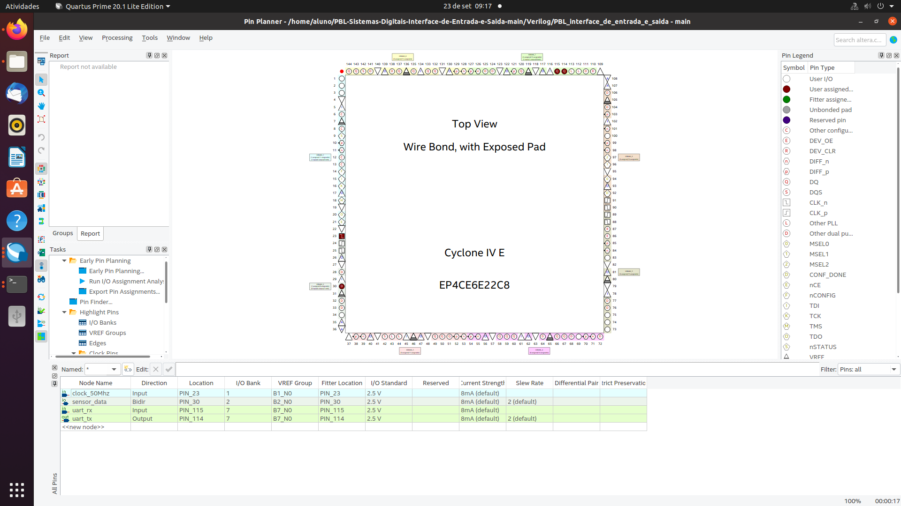
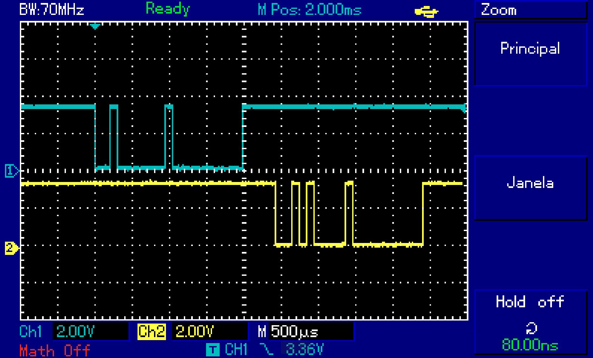
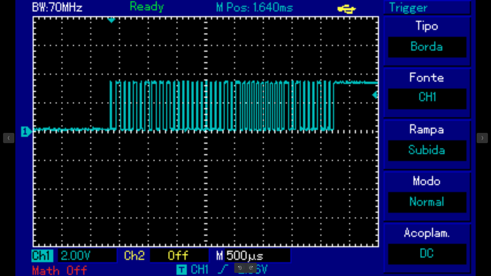

<h1 align="center"> Interface de Entrada e Saída </h1>
<h3 align="center"> Projeto de leitura de sensor digital em FPGA através de comunicação serial. </h3>  

<h2 id="sobre-o-projeto">  Sobre o Projeto</h2>

 
  O dispositivo FPGA Cyclone IV é usado para processar os dados de humidade e temperatura lidos pelo sensor DHT11. O envio de comandos para a placa e visualização dos dados coletados é feito através do computador, com o código implementado em linguagem C. Essa comunicação é serial do tipo UART. O sistema foi feito com o intuito de ser modular, possuindo a capacidade de mudar o tipo de sensor utilizado, sem mexer em áreas do circuito além daquela relacionada ao próprio sensor.

  Os requisitos base seguidos para a execução do projeto são:

* Código do computador implementado em linguagem C.
* Ser capaz  de interligar até 32 endereços.
* Ser capaz de configurar os sensores.
* Apenas o computador pode iniciar uma comunicação para executar o sistema, exceto em casos de sensoriamento contínuo. 
* O código da placa FPGA deve ser escrito em linguagem verilog, tendo a capacidade de ler, interpretar e executar comandos vindos do computador.
* Os comandos são compostos de 1 byte cada um.
* As requisições enviadas e respostas recebidas são compostas de 2 bytes.

<h2>  Equipe:  </h2>
<uL> 
	<li>Samara dos Santos Ferreira </li>
	<li>Silvio Azevedo de Oliveira </li>
	<li>Sival Leão de Jesus </li>
  <li>Thiago Neri dos Santos Almeida </li>
</ul>

<h2 align="center"> Sumário </h2>

&nbsp;&nbsp;&nbsp;[**1.** Diagrama Geral](#Diagrama)

&nbsp;&nbsp;&nbsp;[**2.** Estrutura do Código C no Terminal](#Estrutura-do-Código-C-no-Terminal)

&nbsp;&nbsp;&nbsp;[**2.** Protocolo do Sistema](#Protocolo-do-Sistema)

&nbsp;&nbsp;&nbsp;[**3.** Recebimento de dados pela FPGA](#Recebimento-FPGA)

&nbsp;&nbsp;&nbsp;[**4.** Transmissão de dados pela FPGA](#transmissao)

&nbsp;&nbsp;&nbsp;[**5.** Sincronização e leitura do sensor DHT11](#sensor-dht11)

&nbsp;&nbsp;&nbsp;[**6.** LEs, LABs e Pinos](#PINOS)

&nbsp;&nbsp;&nbsp;[**6.** Teste Realizados](#Teste)

&nbsp;&nbsp;&nbsp;[**7.** Execução do Projeto](#como-usar)

&nbsp;&nbsp;&nbsp;[**8.** Conclusão](#conclusao)

<h2 id="Diagrama">  Diagrama Geral</h2>

](Imagens/Diagrama-do-Projeto.jpg)

<h2 id="Protocolo"> Protocolo do Sistema</h2>

 

 O protocolo é responsável pela definição dos comandos de requisição, que solicitam a execução de ações específicas, e suas respostas correspondentes, que permitem o controle adequado do sistema. Abaixo, tem-se a descrição dos comandos de requisição do protocolo, os quais contém a sua descrição e entre parênteses, seu código específico:

  * **Solicitar Situação Atual do Sensor (0x01):** obtenção das informações sobre a situação atual do sensor, cuja resposta indicará se está funcionando normalmente ou se há algum problema;
  * **Solicitar Medição de Temperatura (0x02):** fornecimento da medida atual de temperatura, caso o sensor esteja funcionando corretamente;
  * **Solicitar Medição de Umidade (0x03):** fornecimento da medida atual de umidade, caso o sensor não esteja com problemas;
  * **Ativar Sensoriamento Contínuo de Temperatura (0x04):** permite que o sistema receba atualizações regulares sobre as leituras de temperatura;
  * **Ativar Sensoriamento Contínuo de Umidade (0x05):** de forma similar ao anterior, mas para a umidade;
  * **Desativar Sensoriamento Contínuo de Temperatura (0x06):** interrupção do envio regular das leituras de temperatura;
  * **Desativar Sensoriamento Contínuo de Umidade (0x07):** interrupção do envio das leituras de umidade.

 Desse modo, é importante ressaltar que a única alteração feita em relação aos requisitos originais, disponibilizados nos requisitos do problema, é a numeração dos códigos dos comandos. No sistema atual, o código 0x00 não é mais válido, sendo omitido da tabela de comandos.

 Além dos comandos de requisição, o protocolo inclui os comandos de resposta, cruciais para fornecer retornos detalhados sobre as solicitações e suas variações. Abaixo, é apresentado a descrição de cada um deles, incluindo os novos adicionados, para fornecer informações mais detalhadas sobre comandos incorretos, endereços inválidos e outras situações excepcionais, identificados pelos códigos: 0xCF, 0xDF, 0xEF e 0x6F:

  * **Problema com o Sensor (0x1F):** indicação de um problema com o sensor, não podendo realizar as medições;
  * **Sensor em Funcionamento (0x07):** confirmação que o sensor está funcionando normalmente, indicando a disponibilidade para coletar os dados;
  * **Medição Atual de Umidade (0x08):** fornece a medição atual de umidade;
  * **Medição Atual de Temperatura (0x09):** fornece a medição atual de temperatura;
  * **Desativação do Sensoriamento Contínuo de Temperatura (0x0A):** confirma a conclusão bem-sucedida da ação de desativação do sensoriamento contínuo de temperatura;
  * **Desativação do Sensoriamento Contínuo de Umidade (0x0B):** indica que o sensoriamento contínuo foi desativado com sucesso;
  * **Comando Não Existe (0xCF):** indicação de que um comando de requisição não reconhecido é recebido;
  * **Endereço Não Existe (0xEF):** endereço não reconhecido é especificado em uma solicitação;
  * **Comando Incorreto (0xDF):** indicação de que um comando foi formulado de maneira incorreta ou não segue o protocolo estabelecido;
  * **Endereço Incorreto do Sensor (0x6F):** sinalização de que o endereço do sensor especificado não está correto;
  * **Resposta Vazia (0xFF):** usado quando não há informações específicas a serem transmitidas ou quando ocorre uma situação inesperada.

<h2 id="Codigo-C"> Estrutura do Código C no Terminal</h2>

 
  A interação entre o computador e a placa é estabelecida através de dois terminais que operam simultaneamente em um ambiente Linux e são programados em linguagem C. Cada terminal desempenha uma função específica na comunicação. O terminal Tx_UART_PC é designado exclusivamente para que o usuário interaja com a placa por meio de comandos específicos. Por outro lado, o terminal Rx_UART_PC é reservado exclusivamente para visualizar as respostas da placa, sem permitir a interação direta do usuário.

  #### **Tx_UART_PC**

O terminal Tx (Transmit Data - Transmitir Dados) é responsável pelo envio de dados para a placa. Nesse terminal, o usuário pode interagir digitando comandos/protocolos de ação, juntamente com endereços de sensores. Ambas as informações devem ser inseridas em formato hexadecimal. Esses dados são temporariamente armazenados em variáveis dentro do código C. Quando o usuário conclui sua interação, os dados em formato hexadecimal são convertidos em valores binários pela UART e enviados via porta serial para a placa. No total, são enviados 2 bytes, sendo o primeiro byte o comando e o segundo o endereço do sensor desejado. O sistema oferece suporte a 32 endereços de sensores e 8 comandos de execução.

Um comando especial é o 0x00 (ou simplesmente 00), cuja função é encerrar imediatamente a execução de ambos os terminais, sem a necessidade de inserir um endereço. Importante destacar que esse comando não é transmitido pela UART.
#### **Rx_UART_PC**

O terminal Rx (Receive Data - Receber Dados) é uma interface projetada para apresentar as respostas das solicitações feitas pelo usuário no terminal Tx de forma amigável. Ele recebe 2 bytes de dados pela placa FPGA em formato binário, que são interpretados pelo código em C como valores hexadecimais. O primeiro byte indica a situação atual do sensor, enquanto o segundo fornece informações complementares, como medidas feitas pelo sensor.

O terminal Rx conta com uma tabela de sensores que exibe os valores de temperatura e umidade medidos. Esses valores não são mostrados em tempo real, em vez disso, o terminal exibe o valor da última medição solicitada pelo usuário. No entanto, em caso de modo contínuo ativo, os valores são atualizados a cada 2 segundos.

#### **Funcionamento do Tx e RX**

O terminal Rx depende do terminal Tx, e essa dependência é gerenciada por meio de 2 variáveis compartilhadas. Somente o terminal Tx pode modificar essas variáveis. O Tx é responsável por informar ao Rx qual sensor está sendo utilizado no momento. Essa informação é usada pelo Rx para atualizar a tabela de temperatura e umidade presente nele. A tabela é composta por 2 arrays, um para temperatura e outro para umidade, e o endereço fornece o índice correspondente na lista. Além disso, o endereço também é exibido quando o modo contínuo está ativo, para que o usuário saiba o endereço no momento da desativação. Se o usuário cometer um erro no endereço, a FPGA também retornarar o endereço correto ativo no modo contínuo.

A segunda variável compartilhada é de controle. Se o usuário digitar 00, o Tx envia um comando para encerrar a execução do Rx. O Tx será encerrado imediatamente, mas o Rx pode ter um atraso de até 1 segundo para encerrar.

<h2 id="Recebimento-FPGA"> Recebimento de Dados pela FPGA</h2>

 
  O processo de recebimento e armazenamento dos 2 bytes enviados pelo PC para a FPGA é gerenciado através da interação entre dois módulos essenciais: "UART RX" e "BUFFER RX".

**UART RX**

 
  O módulo “UART RX” tem como função principal receber os dados enviados pelo computador no padrão UART (Universal Asynchronous Receiver/Transmitter), através do código em linguagem C. Este drive, implementado em Verilog, possui duas entradas e duas saídas:

  * **clk** (entrada): está associada ao pulso de clock com uma frequência de 50 Mhz.

  * **input_rx** (entrada): corresponde aos dados recebidos de forma serial.

  * **out_rx** (saída): representam um barramento de um byte que junta o conjunto de bits convertidos para formato paralelo.

  * **done** (saída): sinaliza a conclusão da captura dos 8 bits.

 
  Para garantir a sincronização adequada entre a UART da FPGA e a taxa de transmissão de dados de 9600 bps da UART do PC, foi calculado o número de pulsos de clock por bit, resultando em um valor de 5208, armazenado no parâmetro "CLKS_PER_BIT". Esse valor é utilizado como base para os contadores, garantindo a integridade da comunicação e evitando perda de bits.

 
  Para realizar o recebimento de dados, foi utilizada uma máquina de estados finitos (MEF) com 4 estados. Nesse sentido, segue o diagrama e a explicação de cada estado:

 

  * **IDLE**: Nesse primeiro estado, a MEF está em estado de ociosidade, esperando por um novo conjunto de bytes. A flag “done” é igual a 0, indicando que nenhum dado está disponível. Os contadores (counter e bit_index) estão zerados. Neste estado, enquanto o sinal "rx_data" permanecer em alto (1), a MEF permanece no estado "IDLE". Caso seja detectada uma mudança para baixo (0), a MEF faz a transição para o estado "START", iniciando a recepção de dados.

  * **START**: No estado de recepção de dados, o contador “counter” é iniciado, e ao atingir a metade do valor de "CLKS_PER_BIT", e o sinal "rx_data" ainda estiver baixo, significa que uma transmissão no modelo UART foi iniciada. Dessa maneira, a MEF faz a transição para o estado "DATA" para guardar os bits. Caso o contrário, ela retorna para o estado "IDLE", já que, o dado captado não representa um sinal válido.

  * **DATA**: A lógica do estado de recepção segue uma ideia parecida com a do estado "START", na qual o primeiro contador (counter) conta até chegar no tempo necessário para o bit ser transmitido – valor armazenado em “CLKS_PER_BIT”. Ao chegar nesse valor, o valor recebido é armazenado no registrador interno do módulo, e o segundo contador (bit_index) é incrementado, e “counter” é zerado, reiniciando o processo. Esse ciclo se mantém até que “bit_index” chegue a 7, sinalizando que os 8 bits foram capturados. Ao chegar a essa condição, a MEF passa para o estado "STOP".

  * **STOP**: No estado final do processo, a MEF finaliza a recepção dos dados. Nesse sentido, a flag “done” é ativada, indicando que um dado está disponível. O contador "counter" realiza uma contagem para aguardar o tempo necessário para a chegada do próximo byte. Assim, ao atingir o valor de "CLKS_PER_BIT", a MEF retorna para o estado "IDLE".

**BUFFER RX**

 
  O módulo "BUFFER RX", por sua vez, tem a função de assegurar a persistência dos dados recebidos e armazenados pela UART RX em um buffer interno de 2 bytes. Essa funcionalidade é necessária devido ao fato de o PC enviar regularmente pacotes de requisição contendo dois bytes de dados. Com o objetivo de evitar conflitos e sobreposições de informações no buffer da UART RX, este módulo opera de forma a capturar e armazenar cada byte de maneira sequencial e organizada. O módulo possui quatro entradas e três saídas:

  * **clock** (entrada): está associado ao pulso de clock com uma frequência de 50 MHz.

  * **new_data** (entrada): representa o sinal da flag "done" da "UART RX" confirmando a disponibilidade de um novo pacote de dados.

  * **data** (entrada): é um barramento de 1 byte que representa o byte armazenado na UART RX.

  * **reset** (entrada): é um sinal utilizado para reiniciar o funcionamento do módulo.

  * **out_address** e **out_command** (saída): representam os dois bytes armazenados, com seus bits devidamente separados, respectivamente, o primeiro representa o endereço e o segundo o comando.

  * **done** (saída): sinaliza que ambos os bytes foram armazenados com sucesso.

 
Para esse modulo foi usado uma MEF com 4 estados, segue o diagrama e a explicação de cada estado:

* **IDLE_1BYTE**: Neste estado, a MEF aguarda o sinal de confirmação de que o primeiro byte foi enviado. A flag "done" permanece em 0, indicando que a recepção não está concluída. Enquanto o sinal "new_data" estiver em 0 (indicando que nenhum byte está disponível), a MEF permanece neste estado. Quando "new_data" assume o valor 1, a máquina faz a transição para o estado "ADD_COMMAND".

* **ADD_COMMAND**: Neste estado, a MEF adiciona o primeiro byte ao registrador de 16 bits. O valor da flag "done" permanece em 0. Enquanto "new_data" indicar que o conteúdo está disponível, o registrador nas posições mais significativas (15:8) é carregado com o valor armazenado na "UART RX". Quando o sinal "new_data" muda de valor (1 para 0), a MEF faz a transição para o estado "IDLE_2BYTE".

* **IDLE_2BYTE**: Esse estado tem uma lógica semelhante ao primeiro estado de espera, na qual, a MEF aguarda o sinal de confirmação de que o segundo byte foi enviado. O valor da flag "done" permanece em 0. Enquanto o sinal "new_data" estiver em 0, a MEF permanece neste estado. Quando "new_data" assume o valor 1, a máquina faz a transição para o estado "ADD_ADDRESS".

* **ADD_ADDRESS**: Neste estado, a MEF adiciona o segundo byte ao buffer. Enquanto o valor de "new_data" indicar que o conteúdo está disponível, o registrador nas posições mais significativas (7:0) é carregado com o valor armazenado na "UART RX". O valor da flag "done" é mantido como 0. Quando o sinal "new_data" muda de valor (1 para 0), a MEF faz a transição de volta para o estado "IDLE_1BYTE". No momento da transição de volta para "IDLE_1BYTE", a flag "done" é definida como 1, indicando que ambos os bytes foram recebidos e o processo foi concluído com sucesso.

<h2 id="transmissao">Transmissão de Dados pela FPGA</h2>

 
  O processo de transmissão dos 2 bytes de resposta enviados pela FPGA para o PC é gerenciado por meio da interação entre dois módulos essenciais: "BUFFER TX" e "UART TX".

**BUFFER TX**

 
O módulo "BUFFER TX" tem o papel de permitir a transmissão sequencial de um pacote de dois bytes por meio da interação com o módulo "UART TX". Basicamente, ele envia esses dois bytes de forma consecutiva, um após o outro, utilizando o driver UART TX. Para atingir esse objetivo, o módulo conta com cinco entradas e 2 saídas:

*	**clk** (entrada): Este é o pulso de clock com uma frequência de 50 MHz.
*	**enable** (entrada): Sinal de controle indicando que a transmissão do pacote (2 bytes) deve ser iniciada.
*	**byte_one** (entrada): O primeiro byte de dados a ser transmitido.
*	**byte_two** (entrada): O segundo byte de dados a ser transmitido.
* **done_tx** (entrada): Um sinal que sinaliza quando a transmissão de um byte foi concluída.
*	**data** (saída): Dado que está sendo transmitido no momento.
*	**send** (saída): : É uma flag utilizada para controlar o início do módulo da "UART TX".

 
Para realizar a sequência dos dados que serão enviados foi usado MEF com 5 estados, segue o diagrama e a explicação:

**IDLE:** Nesse estado, a MEF está em repouso, aguardando o sinal de controle "enable" indicando o início da transmissão. Todos os contadores são zerados, o sinal "send" para a "UART TX" está em baixo (0), indicando que não há dados a serem transmitidos, e o dado na saída "data" é mantido em 0. Quando o sinal "enable" muda para 1, indicando que há dados a serem transmitidos, a MEF avança para o estado "SEND_BYTE_ONE".

**SEND_BYTE_ONE:** Nesse estado, a MEF inicia a transmissão do primeiro byte de dados ("byte_one") para a "UART TX". O contador "send" é colocado em 1, indicando que a transmissão está em andamento. O dado na saída "data" corresponde ao "byte_one". Após a conclusão da transmissão do primeiro byte, a MEF avança para o estado "STOP_ACK_1".

**STOP_ACK_1:** Nesse estado, a MEF aguarda o sinal "done_tx" que sinaliza que a transmissão do primeiro byte foi concluída com sucesso. Se o sinal "done_tx" for detectado, a MEF avança para o estado "SEND_BYTE_TWO", indicando que é hora de transmitir o segundo byte. Caso contrário, permanece no estado "STOP_ACK_1".

**SEND_BYTE_TWO:** Agora, a MEF inicia a transmissão do segundo byte de dados ("byte_two") para a "UART TX". O contador "send" permanece em 1 para indicar que a transmissão está em andamento, e o dado na saída "data" corresponde ao "byte_two". Após a conclusão da transmissão do segundo byte, a MEF avança para o estado "STOP_ACK_2".

**STOP_ACK_2:** Nesse estado, a MEF aguarda o sinal "done_tx" que sinaliza que a transmissão do segundo byte foi concluída com sucesso. Se o sinal "done_tx" for detectado, a MEF retorna ao estado "IDLE" (Ocioso), indicando que a transmissão dos dois bytes foi concluída com sucesso. Caso contrário, permanece no estado "STOP_ACK_2".

**UART TX**

 
O módulo "UART TX", por outro lado, é projetado para implementar um driver de transmissão de dados no padrão UART, permitindo a transferência dos dados da FPGA para o computador através da porta serial. Para executar esse processo, o módulo possui três entradas e duas saídas:

- **clk** (entrada): Este é o pulso de clock com uma frequência de 50 MHz.
- **initial_data** (entrada): Trata-se da flag "send" enviada pelo módulo "BUFFER TX", indica o momento em que a transmissão de dados deve ser iniciada.
- **data_transmission** (entrada): É um barramento de 1 byte, enviado pelo modulo "BUFFER TX", que carrega os dados a serem enviados.
- **out_tx** (saída): Representa os dados que serão transmitidos serialmente pela porta serial.
- **done** (saída): É uma flag que sinaliza quando a transmissão foi concluída.

 
Para garantir a sincronia entre a frequência de clock e a taxa de baud de 9600 bps, o valor 5208 é configurado no parâmetro "CLKS_PER_BIT". Isso estabelece uma base sólida para os contadores, assegurando a integridade da comunicação e prevenindo perda de bits.

 
O processo de transmissão é controlado por uma MEF com 4 estados, segue o diagrama e a explicação:

**IDLE**: Neste estado, a MEF está em estado ocioso. Todos os contadores estão zerados, "done" está definido como 0 (indicando que a transmissão ainda não começou), e "out_tx" está configurado como alto (1), que é o estado padrão da UART. Se "initial_data" mudar de 0 para 1, indicando a presença de novos dados a serem enviados, a MEF transita para o estado "START". Caso contrário, ela permanece no estado "IDLE".

**START**: Neste estado, a MEF envia o bit de início (START) da transmissão. O contador "counter" é iniciado, e "out_tx" é definido como 0. A MEF permanece nesse estado até que "counter" alcance o valor de "CLKS_PER_BIT", garantindo o timing adequado para a transmissão do bit de início. Após a contagem, "counter" é zerado, e a MEF progride para o estado "DATA".

**DATA**: Neste estado, a MEF transmite os bits de dados um por um. Cada bit de "data_transmission" é inserido em "out_tx", e o contador "counter" controla o tempo de transmissão de cada bit. O contador "bit_index" mantém o registro do número de bits já enviados. Quando "bit_index" atinge 7, indicando que todos os bits foram transmitidos, a MEF avança para o estado "STOP".

**STOP**: No último estado, a MEF sinaliza o término do processo. O sinal de "out_tx" retorna ao estado alto (1), indicando o final da transmissão, o contador "bit_index" é zerado, e o contador "counter" realiza uma última contagem. Após essa contagem, "done" é definido como 1, indicando que a transmissão foi concluída com sucesso, e a MEF retorna ao estado "IDLE".

<h2 id="sensor-dht11"> Sincronização e Leitura do Sensor DHT11</h2>

 

O módulo geral de sincronização e leitura do DHT11 possui os seguintes valores de entradas e saídas:

* **clk** (entrada): Pulso de clock com frequência de 50MHz. A frequência usada nessa parte do sistema é de 1 MHz, então o sinal de 50 MHz é dividido dentro do módulo para ser utilizado.
* **rst_n** (entrada): Sinal de reset da máquina de estados.
* **dat_io** (entrada/saída): pino de envio e recebimento de dados do DHT11.
* **data** (saída): Barramento de 40 bits, contendo os dados transmitidos pelo DHT11.

 
    Os processos de sincronização e leitura do DHT11 são feitos a partir de uma máquina de estados, que se ativa quando o valor da entrada reset é 1, caso contrário, a máquina, e todos os recursos utilizados no decorrer dela, são resetados. A partir do nível lógico alto (1) do reset é feito um sinal de enable que se ativa por um curto período, para impedir que a máquina se ative uma segunda vez sem ter sido resetada.

Os 11 estados da máquina são explicados a seguir:

* **IDLE**: Estado inicial da máquina. Aguarda o sinal de ativação do enable (1) para começar a enviar o sinal de start para o DHT11. Em seguida, vai para o estado "START_BIT".

* **START_BIT**: Envia nível lógico baixo (0) para o sensor por 19 ms. Esse é o primeiro passo de ativação do sensor. Em seguida, vai para o estado "SEND_HIGH_20US".
* **SEND_HIGH_20US**: Envia nível lógico alto (1) para o sensor por 20 us. Após isso, é terminada a parte de sincronização por parte da FPGA, indo para o estado "WAIT_LOW". Agora, apenas serão recebidos dados do sensor.
* **WAIT_LOW**: É esperado que o sensor envie nível lógico baixo (0) antes do tempo limite de 65 us. Caso passe o limite de tempo, vai para o estado "ERROR". No caso do recebimento esperado, vai para o estado "WAIT_HIGH".
* **WAIT_HIGH**: É esperado que o sensor envie nível lógico alto (1) antes do tempo limite de 65 us. Caso passe o limite de tempo, vai para o estado "ERROR". No caso do recebimento esperado, vai para o estado "FINAL_SYNC".
* **FINAL_SYNC**: Última etapa de sicronização. É esperado que o sensor envie nível lógico baixo (0) antes do tempo limite de 65 us. Caso passe o limite de tempo, vai para o estado "ERROR". No caso do recebimento esperado, significa que o sensor está pronto para enviar os bits de dados, indo para o estado "WAIT_BIT_DATA".
* **WAIT_BIT_DATA**: Período anterior ao envio de um bit de dado. É esperado que o sensor envie nível lógico alto (1) antes do tempo limite de 65 us. Caso passe o limite de tempo, vai para o estado "ERROR". No caso do recebimento esperado, vai para o estado "READ_DATA", que faz a identificação e coleta do bit de dado.
* **READ_DATA**: Cronometra o tempo que o sensor envia nível lógico alto (1) para identificar se o bit enviado é 1 ou 0. Se o tempo for maior que 60 us, significa que foi enviado o bit 1, se for menor, o bit 0. Toda vez que um bit de dado é registrado, é checada a quantidade lida até o momento, caso não tenha atingido os 40 bits, vai para o estado "WAIT_BIT_DATA" para recomeçar a contagem para o próximo bit. Quando todos os 40 são lidos, vai para o estado "COLLECT_ALL_DATA". O sensor pode enviar o nível lógico alto (1) por 65 us, se esse tempo for ultrapassado, vai para o estado "ERROR".
* **COLLECT_ALL_DATA**: Transmite os 40 bits coletados para a saída do módulo. É checado se o pino de entrada e saída do DHT11 está enviando nível lógico alto (1), indicando que a transmissão foi finalizada, indo para o estado "END_PROCESS". Caso não esteja enviando nível lógico alto (1), é esperado o tempo de 65 us para o sinal se normalizar, caso passe o tempo, vai para o estado de "IDLE" direto.
* **END_PROCESS**: Último estado do processo normal da máquina. Vai para o estado de "IDLE".
* **ERROR**: Representa a situação de ter ocorrido um erro durante a sincronização ou leitura de dados do sensor. Coloca todos os bits da saída como 1 para indicar que um erro aconteceu. É checado se o pino de entrada e saída do DHT11 está enviando nível lógico alto (1), se estiver, vai para o estado "END_PROCESS". Caso não esteja enviando nível lógico alto (1), é esperado o tempo de 65 us para o sinal se normalizar, caso passe o tempo, vai para o estado de "IDLE" direto.

<h2 id="PINOS">  LEs, LABs e Pinos</h2>

](Imagens/LE-LAB.png)

<strong> Elementos Lógicos (LE), Laboratórios Lógicos (LABs) e Pinos utilizados.</strong> 

<strong> Pin planner com a pinagem utilizada na FPGA.</strong> 

<h2 id="Teste">  Teste Realizados</h2>

 

Para verificar a confiabilidade de cada módulo antes de sua integração com os demais, foram conduzidos testes individuais em cada conjunto de módulos. Para isso, utilizou-se um osciloscópio para monitorar os sinais de recebimento e transmissão da FPGA, bem como o software ModelSim para avaliar o funcionamento dos módulos, assegurando que estivessem operando conforme o esperado.

<strong> Testes de Módulo </strong>

No procedimento de teste para o recebimento e transmissão de dados, o osciloscópio foi empregado, com o sinal de recebimento alocado no canal 1 (cor azul) e o sinal de transmissão alocado no canal 2 (cor amarela). Foram enviados os bytes representando 0x01 e 0x00, obtendo como resposta a recepção dos bytes 0x0a e 0x00. Esses resultados confirmaram que o recebimento de dois bytes e o envio de dois bytes estavam funcionando conforme o planejado. Anexa, encontra-se a imagem da captura de tela da situação descrita:

 <strong> recepção do byte 0x0a e 0x00 e, em seguida, transmissão do byte 0x01 e 0x00, confirmando que a placa está recebendo e respondendo aos dados conforme o esperado.</strong> 

Para verificar a comunicação entre a placa e o sensor DHT11, também foi utilizado um osciloscópio. Nesse contexto, foi conduzida uma análise no osciloscópio para verificar se a placa estava sincronizando com sucesso o sensor e obtendo acesso aos 5 bytes enviados por ele. Foram anexadas duas imagens ilustrativas desse processo:

<strong> Período de sincronização entre a placa e o sensor DHT11, o que confirma que a placa estava estabelecendo uma comunicação adequada com o sensor.</strong> 

 <strong> Medição de temperatura e umidade enviada pelo sensor. </strong>

<strong> Testes Gerais </strong>

Após confirmar a integridade de cada módulo, procedemos aos testes com o sistema completamente integrado. Com base nos testes realizados, podemos concluir que todas as solicitações de projeto foram atendidas. Dentro desse contexto, os comandos de requisição e resposta foram devidamente implementados, junto com uma interface de teste em linguagem C. Para ilustrar esses resultados, estão anexados os testes que demonstram esses êxitos:

<strong> O comando de solicitação do status do sensor confirma que o sensor está em pleno funcionamento. </strong> 

<strong> O comando de solicitação de medição de temperatura retorna a informação de que a temperatura ambiente é de 21 °C.</strong> 

<strong> O comando de solicitação de medição de umidade indica que o ambiente possui uma umidade de 39%. </strong>

<strong> O comando de monitoramento contínuo de temperatura foi solicitado e indicou que a temperatura ambiente é de 21°C.</strong> 

<strong> Modo contínuo mostrado no osciloscópio.</strong> 

<strong> O comando de monitoramento contínuo de temperatura está ativo. Ao tentar usar outro sensor, recebe-se a mensagem de que não é possível acessá-lo, juntamente com a informação sobre qual sensor está atualmente em execução. </strong>

<strong> O comando de monitoramento contínuo de temperatura está ativo. No entanto, ao solicitar o uso de outra função para o sensor, recebe-se a mensagem de que não é possível acessar essa função no momento. </strong>

<strong> O comando de monitoramento contínuo de temperatura está ativo, mas está sendo relatado que o sensor apresenta um problema. </strong>

<strong> O comando de monitoramento contínuo de temperatura foi desativado, e uma mensagem de confirmação foi emitida. </strong>

<strong> O comando de monitoramento contínuo de umidade indica um valor de umidade de 39%. </strong>

 <strong> O comando de monitoramento contínuo de umidade foi desativado, e uma mensagem de confirmação foi emitida. </strong>

<strong> Foi tentada a inserção de um endereço que não existe, e um aviso foi gerado informando que o endereço do sensor não está disponível ou não existe.</strong>

](Imagens/Comando-invalido_.png)

 <strong>
Foi tentada a inserção de um comando que não existe, e um aviso foi gerado informando que o comando não está disponível ou não existe.</strong>

A tabela a seguir foi elaborada com o propósito de validar o projeto. Esses testes garatem que o sistema opere adequadamente em diversas situações e forneça resultados confiáveis aos usuários.

<h2 id="como-usar">  Execução do Projeto</h2>

 
Os comandos aceitos pelo sistema estão no intervalo de 0x00 a 0x07, e os endereços disponíveis variam de 0x00 a 0x1F. Vale mencionar que o uso do prefixo "0x" não é obrigatório, pois o código em C reconhece ambos os formatos de entrada. Se o usuário inserir um valor que não seja hexadecimal ou que seja maior que 0xFF, o sistema exibirá uma mensagem de erro e solicitará que o usuário insira novamente os dados, seguindo os requisitos estabelecidos para garantir o funcionamento adequado do sistema.

        gcc -o t Tx_UART_PC.c
2ª Executar o arquivo:
        
        ./t

Em seguida, você pode executar o arquivo "Rx_UART_PC.c" para visualizar as respostas da placa. Se o terminal Rx for executado antes do Tx, pode ocorrer um encerramento inesperado, pois as variáveis compartilhadas não terão sido criadas ou atualizadas corretamente. É necessário abrir outro terminal para executar o Rx e digitar os seguintes comandos:

1ª Compilar o código:

        gcc -o r Rx_UART_PC.c

2ª Executar o arquivo:

        ./r

A ordem de inicialização da placa FPGA em relação aos terminais não é relevante, pois o sistema é projetado para funcionar independentemente da sequência.

Com todos os sistemas em funcionamento, o usuário pode utilizar o teclado para inserir os comandos e endereços desejados. É importante verificar se o terminal Tx está mostrando a interação que ocorre no teclado. Caso contrário, basta clicar com o botão esquerdo do mouse sobre o terminal Tx para garantir que as entradas do usuário sejam registradas.

Os comandos aceitos pelo sistema estão no intervalo de 0x00 a 0x07, e os endereços disponíveis variam de 0x00 a 0x1F. Vale mencionar que o uso do prefixo "0x" não é obrigatório, pois o código em C reconhece ambos os formatos de entrada. Se o usuário inserir um valor que não seja hexadecimal ou que seja maior que 0xFF, o sistema exibirá uma mensagem de erro e solicitará que o usuário insira novamente os dados, seguindo os requisitos estabelecidos para garantir o funcionamento adequado do sistema

#### **Observações:**
* **Executar Rx_UART_PC.c antes de Tx_UART_PC.c:** Resultará no encerramento imediato do Rx, pois as variáveis de controle não foram criadas ou atualizadas pelo Tx.
* **Desligar a placa enquanto o modo contínuo estiver ativo:**  Quando o modo contínuo está ativo, o Tx_UART_PC.c bloqueia a variável de endereço exibida no Rx. Ela só será desbloqueada quando o comando de desativação for inserido com o endereço correto. Se a placa for desligada, a medição contínua será desativada automaticamente. A solução é reiniciar o terminal Tx ou inserir o comando de desativação contínua com o endereço correto para desbloquear a variável. A placa não precisa estar ligada para realizar esse procedimento.
* **Comandos e endereços iniciados com "0x":** Pode ocorrer um falso aviso de erro ao inserir comandos que começam com "0x". Isso ocorre devido a um bug ao limpar o buffer do teclado. Quando o usuário digita o comando começando com "0x" e confirma, o buffer do teclado pode conter um valor aleatório, conhecido como "lixo de memória". Esse valor pode ser exibido como um hexadecimal inválido. No entanto, a entrada de comando foi aceita e a próxima entrada será o de endereço mesmo contendo o aviso. O código fornecerá informações sobre o que está sendo solicitado no momento.

<h2 id="conclusao">  Conclusão</h2>

 
  O computador executa bem a comunicação serial com o dispositivo FPGA, enviando os comandos de requisição e recebendo os comandos de resposta corretamente. A placa faz sua função para cada dado recebido, validando os comandos e endereços coletados e enviando as respostas apropriadas. É possível ativar o sensor DHT11 e coletar os dados enviados por ele de modo estável, mantendo o módulo responsável por essa comunicação modularizado. Todos os objetivos pretendidos com a criação do projeto foram executadas com sucesso.

